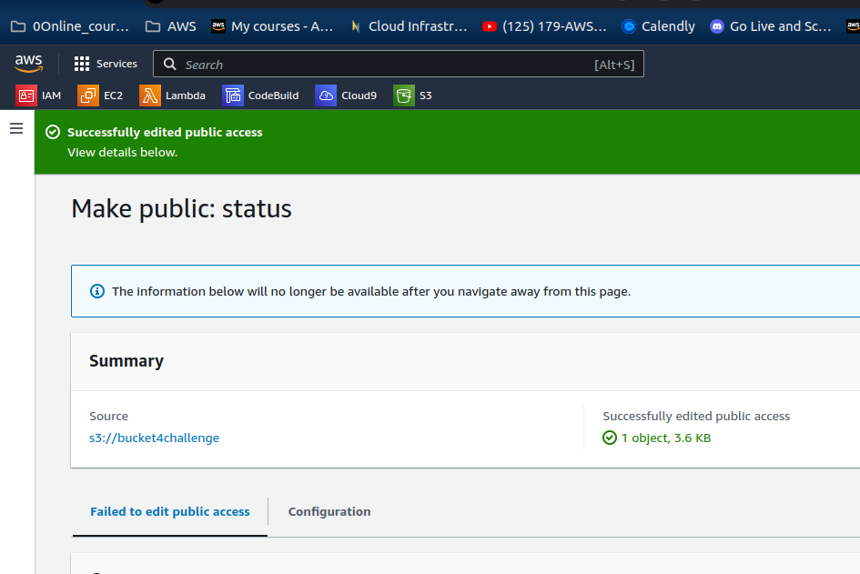

` Create an S3 bucket.  `

` Upload an object into this bucket. `

` Access the object by using a web browser. `

` List the contents of the S3 bucket by using the AWS Command Line Interface (AWS CLI) `

